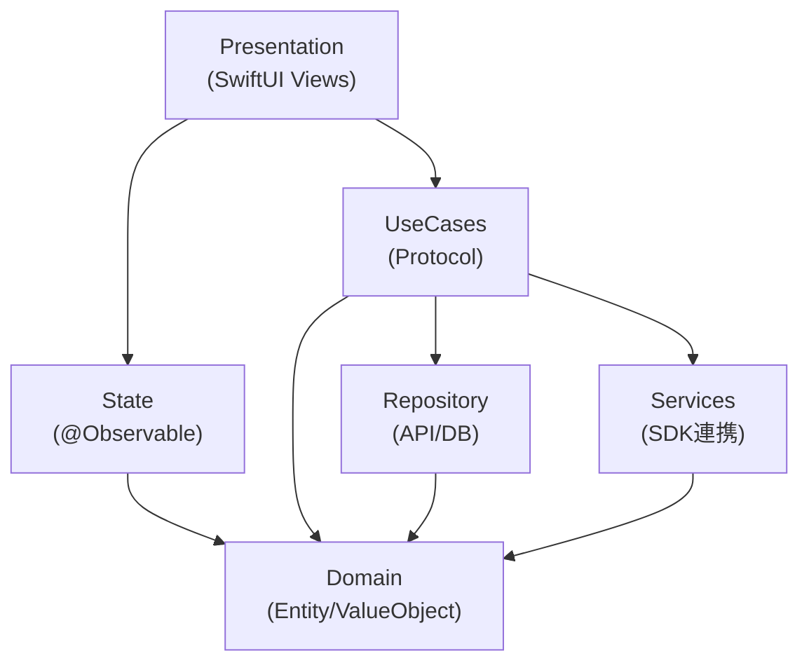

## 目次

1. [はじめに](#1-はじめに)
2. [ViewModelの問題点](#2-viewmodelの問題点)
3. [クリーンアーキテクチャをSwiftUIに合わせて活用する](#3-クリーンアーキテクチャをswiftuiに合わせて活用する)
4. [Environmentによる柔軟な状態共有](#4-environmentによる柔軟な状態共有)
5. [提唱するアーキテクチャ：SPMマルチモジュール構成](#5-提唱するアーキテクチャspmマルチモジュール構成)
6. [StateパッケージとViewModelの違い](#6-stateパッケージとviewmodelの違い)
7. [AIエージェントとの協働を前提とした設計](#7-aiエージェントとの協働を前提とした設計)
8. [まとめ](#8-まとめ)

---

## 1. はじめに

こんにちは、個人でiOSアプリ開発をしていて、最近では「[読書メモリー](https://apps.apple.com/jp/app/id6751159926)」という本の管理アプリをリリースしました。
本記事では、ViewModelを使わず、クリーンアーキテクチャに厳密に従わない、柔軟で軽量なiOSアーキテクチャを提唱します。

従来のMVVMやクリーンアーキテクチャは、UIKitやRxSwift/Combineを前提とした設計思想に基づいています。しかし、SwiftUIと@Observable、Swift Concurrencyの登場により、これらの前提は大きく変わりました。本記事では、SwiftUIの特性を活かしつつ、SPMパッケージ分割による明確な責務分離を実現するアーキテクチャを、自分なりに考えて提唱します。

このアーキテクチャは、個人開発アプリ「[読書メモリー](https://apps.apple.com/jp/app/id6751159926)」で実践しており、中小規模のアプリ開発において使いやすいと感じています。また、Claude CodeなどのAIエージェントとの相性も良く、設計原則をドキュメント化することで一貫した実装品質を維持できます。

本記事では、まずViewModelの問題点を整理し、次にクリーンアーキテクチャをSwiftUIに合わせて活用する考え方を述べます。その上で、Environmentによる柔軟な状態共有の利点を説明し、最終的に提唱するSPMマルチモジュール構成のアーキテクチャを紹介します。

---

## 2. ViewModelの問題点

### 2.1 ファットViewModelへの回帰

iOSアプリ開発において、UIKitのViewControllerに責務が集中する「FatViewController」問題を解決するため、MVVMパターンとともにViewModelが広く採用されてきました。

しかし、ViewModelを導入しても責務の肥大化は解決されないケースが多く見られます。UIとビジネスロジックは分離されたものの、UIインタラクションに紐づくロジック（ボタンタップ時の処理、入力バリデーション、画面遷移の制御など）はViewModelに残ります。結果として、FatViewControllerがFatViewModelに置き換わっただけという状況に陥りがちです。

### 2.2 「ViewModel」という命名の曖昧さ

MVVMパターンにおけるViewModelは、ViewとModelの橋渡し役として設計されました。iOSでは、RxSwiftやCombineを用いたリアクティブプログラミングにより、ViewModelが保持するデータの変更をViewに自動反映するデータバインディングが実現されていました。この文脈において、ViewとModelを繋ぐ層としてViewModelという命名は適切でした。

しかし、現代のiOS開発におけるViewModelの実態は「Viewに紐づく状態の保持と操作」です。データバインディングの仕組みがSwiftUI側に移ったことで、ViewModelの役割は状態管理に特化しつつあります。この実態を踏まえ、ViewModelよりも**ViewState**という命名のほうが適切だという意見も見られるようになっています。

### 2.3 SwiftUIの登場による変化

SwiftUIは、Combineを明示的に使わなくてもデータバインディングを実現します。@Stateや@Bindingといったプロパティラッパーにより、状態の変更が自動的にViewに反映されます。

さらにiOS 17で導入されたObservationフレームワークにより、監視対象のデータ構造に依存しない、より柔軟な変更通知が可能になりました。従来のObservableObjectプロトコルでは、@Publishedを付与したプロパティのみが監視対象でしたが、Observationフレームワークの@Observableマクロを使うことで、プロパティ単位で自動的に変更が追跡されます。

これらの進化により、ViewとModelの間にデータバインディングのための中間層を置く必然性は薄れました。

### 2.4 Swift ConcurrencyとActor Isolation

Swift Concurrencyの導入により、データ競合を防ぐためのActor Isolationが重要になりました。UI更新に関わる状態は@MainActorで保護する必要があります。

この観点から考えると、UI状態をViewModelという別クラスに切り出すよりも、View自体に@Stateとして状態を持たせるほうがシンプルな場合もあります。SwiftUI Viewは暗黙的にMainActor上で動作するため、Isolationの管理が容易になります。

---

## 3. クリーンアーキテクチャをSwiftUIに合わせて活用する

### 3.1 クリーンアーキテクチャの価値

クリーンアーキテクチャは、依存関係の方向を内側（ビジネスロジック）に向け、外側の詳細（UI、データベース、フレームワーク）から独立させるという設計原則です。テスタビリティや保守性の向上に大きく貢献し、iOSアプリ開発においても参考にすべき考え方です。

### 3.2 厳密に従う必要はない

一方で、クリーンアーキテクチャをそのまま厳密に適用すると、iOSアプリの規模や特性に合わない場合があります。

たとえば、UseCase層やService層が単なるパススルー（データを受け渡すだけの土管）になってしまうケースがあります。「層を置くこと」自体が目的化してしまうと、コードの複雑さが増すだけで本来の設計意図から外れてしまいます。

クリーンアーキテクチャは大規模なエンタープライズアプリケーションを念頭に置いて設計された側面もあり、中小規模のモバイルアプリにそのまま適用すると過剰になることがあります。

### 3.3 SwiftUIの特性に合わせた設計へ

重要なのは、クリーンアーキテクチャの原則（依存関係の方向性、レイヤー分離、テスタビリティ）を理解した上で、SwiftUIの特性に合わせて柔軟に取り入れることです。

SwiftUIは宣言的UIフレームワークであり、状態管理やデータフローに独自の仕組みを持っています。この特性を活かしつつ、クリーンアーキテクチャの良い部分を取り入れた設計を目指すのが現実的なアプローチだと考えています。

---

## 4. Environmentによる柔軟な状態共有

### 4.1 従来の「1画面1ViewModel」設計の限界

従来のiOS開発では、「1画面につき1ViewModel」という設計パターンが広く採用されてきました。この設計には、状態の所在が明確になるというメリットがあります。

しかし、この設計はView階層が深くなると問題が生じます。親Viewが持つViewModelの状態を子Viewに渡すために、プロパティを順番に受け渡していく「バケツリレー」が発生します。これはコードの冗長さを生み、Viewの再利用性を下げる原因になります。

### 4.2 Environmentで「1画面1ViewModel」が不要に

SwiftUIのEnvironmentを使うことで、この問題を解決できます。Environmentは、View階層の任意のスコープで状態を共有する仕組みです。

親Viewで`.environment()`を使って状態を注入すれば、その配下のすべての子Viewから`@Environment`プロパティラッパーで直接アクセスできます。バケツリレーは不要になり、画面単位ではなく「View階層」単位で状態を管理できるようになります。

これにより、「1画面につき1ViewModel」という制約から解放され、状態のスコープを柔軟に設計できます。

### 4.3 SSOTを意識した設計

Environmentを活用する際に重要なのは、SSOT（Single Source of Truth）の原則です。同じデータが複数の場所に存在すると、データの不整合が発生するリスクがあります。

Environmentを使えば、特定のView階層において状態の唯一の情報源を定義し、その配下のViewから参照・更新できます。状態の所在が明確になり、データの一貫性を保ちやすくなります。

---

## 5. 提唱するアーキテクチャ：SPMマルチモジュール構成

ここまでの議論を踏まえ、本記事で提唱するアーキテクチャを紹介します。

このアーキテクチャの特徴は、Swift Package Manager（SPM）を使って責務ごとにパッケージを分割する点です。パッケージ単位で依存関係を定義することで、設計ルールをコンパイル時に強制できます。

### 5.1 パッケージ構成図

以下の6つのパッケージで構成されます。



### 5.2 各パッケージの責務

| パッケージ | 責務 |
|---|---|
| **Domain** | ビジネスエンティティ・値オブジェクト（UI非依存） |
| **State** | @Observable状態管理（ViewModelの代替） |
| **UseCases** | Viewから呼び出されるビジネスロジック |
| **Repository** | API通信・データ永続化 |
| **Services** | 外部SDK連携（HealthKit, CoreLocation等） |
| **Presentation** | SwiftUI View・UIコンポーネント |

### 5.3 パッケージ分割の利点

パッケージ分割には以下の利点があります。

- **設計違反がコンパイルエラーになる**: パッケージのPackage.swiftで依存関係を定義するため、許可されていないパッケージをimportしようとするとコンパイルエラーになります
- **循環参照を防止できる**: SPMは循環依存を許可しないため、設計上の問題を早期に検出できます
- **責務の境界が明確になる**: パッケージという物理的な境界があることで、責務の混在を防ぎやすくなります

---

## 6. StateパッケージとViewModelの違い

本アーキテクチャにおけるStateパッケージは、従来のViewModelとは明確に異なります。ここではその違いを説明します。

### 6.1 従来のViewModelはビジネスロジックを持っていた

従来のViewModel的な考え方では、ViewModelがUseCaseやRepositoryを呼び出してビジネスロジックを実行していました。

```swift
// 従来のViewModel的なアプローチ
@Observable
class UserViewModel {
    private(set) var user: User?
    private let repository: UserRepository  // ビジネスロジックへの依存

    func fetchUser(id: String) async {
        user = try? await repository.fetchUser(id: id)  // ロジックがここに
    }
}
```

この設計では、ViewModelが状態の保持とビジネスロジックの実行という2つの責務を持つことになります。

### 6.2 本アーキテクチャのStateはビジネスロジックを持たない

本アーキテクチャでは、StateパッケージはDomainのみに依存し、ビジネスロジックを一切持ちません。Stateは「状態を保持する箱」に徹します。

```swift
// 本アーキテクチャのState
@MainActor
@Observable
public final class UserState {
    public private(set) var user: User?

    public func setUser(_ user: User?) {
        self.user = user
    }
}
```

StateパッケージはUseCasesパッケージに依存できないため、ビジネスロジックが混入することを構造的に防げます。これがパッケージ分割の大きなメリットです。

### 6.3 StateとUseCaseの責務分離

State、UseCases、Presentationの責務と依存関係は以下のようになります。

| 層 | 責務 | 依存先 |
|---|---|---|
| **State** | 状態の保持・更新メソッドの提供 | Domainのみ |
| **UseCases** | ビジネスロジックの実行 | Domain, Repository, Services |
| **Presentation** | StateとUseCasesを組み合わせる | State, UseCases |

### 6.4 UseCaseの設計

UseCaseはビジネスロジックを実行し、ドメインエンティティを返します。UseCaseはRepositoryやServicesに依存し、データの取得・永続化を行います。

```swift
// UseCases層
public struct UserUseCase: Sendable {
    private let userRepository: UserRepository

    public init(userRepository: UserRepository) {
        self.userRepository = userRepository
    }

    public func getUser(id: String) async throws -> User {
        try await userRepository.getUser(id: id)
    }

    public func updateUser(_ user: User) async throws -> User {
        try await userRepository.updateUser(user)
    }
}
```

### 6.5 UseCaseのDI（依存性注入）

UseCaseはEnvironmentを通じてDIされます。UseCaseContainerプロトコルを定義し、`@Environment(\.dependencies)`でアクセスすることで、Viewから具体的なUseCaseの生成方法を隠蔽します。

```swift
// UseCases層：UseCaseContainerプロトコル
public protocol UseCaseContainer {
    var user: UserUseCase { get }
    var book: BookUseCase { get }
    // ... 他のUseCase
}

// Presentation層：Dependenciesプロトコル
public protocol Dependencies {
    var useCase: UseCaseContainer { get }
}

// EnvironmentKeyの定義
public struct DependenciesKey: EnvironmentKey {
    public static let defaultValue: Dependencies = DefaultDependencies()
}

public extension EnvironmentValues {
    var dependencies: Dependencies {
        get { self[DependenciesKey.self] }
        set { self[DependenciesKey.self] = newValue }
    }
}
```

### 6.6 View側の責務

Viewの責務は「Environment経由でUseCaseを取得し、呼び出し、結果をStateに反映する」ことです。複雑なビジネスロジックはすべてUseCaseに閉じ込め、Viewはそれを呼び出すだけにします。

```swift
// Presentation層（View）
struct UserProfileView: View {
    @Environment(UserState.self) private var userState
    @Environment(\.dependencies) private var dependencies

    var body: some View {
        // userState.userを使って表示
        // ...
    }

    private func loadUser(id: String) async {
        do {
            let user = try await dependencies.useCase.user.getUser(id: id)
            userState.setUser(user)
        } catch {
            userState.setError(error)
        }
    }
}
```

UseCaseから返されたドメインエンティティをStateに反映し、表示に必要なフォーマット変換はView側で行います。

---

## 7. AIエージェントとの協働を前提とした設計

本アーキテクチャは、Claude CodeなどのAIエージェントとの協働を前提として設計しています。個人開発アプリ「[読書メモリー](https://apps.apple.com/jp/app/id6751159926)」は、ほぼすべてのコードをClaude Codeで実装しています。この経験を通じて得た知見を共有します。

### 7.1 人間が制約を設計する必要性

AIエージェントは指示に従ってコードを生成する能力に優れていますが、プロジェクト固有のアーキテクチャを自ら考案する能力はまだ限定的です。「このプロジェクトではStateパッケージにビジネスロジックを持たせない」といった設計上の制約は、人間が明示的に定義し、AIエージェントに伝える必要があります。

AIエージェントは与えられた制約の中で最適な実装を行うことは得意ですが、制約そのものを設計することは人間の役割です。この役割分担を意識することで、AIエージェントの能力を最大限に活かせます。

### 7.2 コンテキストエンジニアリングの観点

AIエージェントに設計原則を遵守させるには、適切なコンテキストを提供することが重要です。これは「コンテキストエンジニアリング」と呼ばれる考え方に基づいています。

重要なのは、**設計原則が簡潔にまとまっており、必要な状況で必ず参照され、必要でないときには参照されない状態を作る**ことです。長大なドキュメントは読み飛ばされる可能性があり、常に参照されるドキュメントはコンテキストを圧迫します。本アーキテクチャでは、パッケージの責務と依存関係のルールを簡潔なマークダウンファイルにまとめ、iOSアプリの設計・実装時にのみ参照されるよう設定しています。具体的な方法は後述します。

### 7.3 フィードバックループによる設計違反の防止

設計原則をドキュメント化するだけでは不十分です。AIエージェントが設計に違反したコードを生成した場合、それを検出して修正させる仕組みが必要です。

ここでSPMパッケージ分割が効果を発揮します。設計違反のコード（たとえばStateパッケージからUseCasesをimportする）は、コンパイルエラーとして検出されます。AIエージェントはエラーを確認し、設計ドキュメントを再参照して、正しい設計に修正できます。

このフィードバックループにより、人間が逐一コードレビューをしなくても、設計原則が自動的に守られます。

### 7.4 Skillsによる再利用

設計原則をプロジェクトごとにCLAUDE.mdに書くこともできますが、iOSアプリ開発で毎回同じアーキテクチャを採用するなら、再利用可能な形で定義しておくほうが効率的です。

Claude CodeにはSkillsという機能があり、設計原則をマークダウンファイルとして定義できます。Skillsとして本アーキテクチャの設計原則を定義しておけば、新しいプロジェクトを始める際に「iOSアプリの設計をして」と指示するだけで、Claude CodeがSkillsを参照し、本アーキテクチャに沿った設計を提案できます。

また、SkillsはPluginsとしてまとめて公開できます。本記事で紹介したアーキテクチャは、[ios-architecture](https://github.com/no-problem-dev/claude-code-plugins)としてPluginを公開しています。このPluginを導入することで、本アーキテクチャの設計原則をすぐに活用できます。

---

## 8. まとめ

本記事では、ViewModelを使わず、クリーンアーキテクチャに厳密に従わない、柔軟で軽量なiOSアーキテクチャを提唱しました。

### 8.1 本アーキテクチャの特徴

本アーキテクチャの特徴を整理します。

- **ViewModelを使わない**: 状態管理はStateパッケージに分離し、ビジネスロジックはUseCasesパッケージに閉じ込めます。Stateはビジネスロジックを持たず、「状態を保持する箱」に徹します
- **Environmentによる柔軟な状態共有**: 「1画面1ViewModel」の制約から解放され、View階層単位で状態を共有できます
- **SPMパッケージ分割による設計ルールの強制**: 依存関係のルールがコンパイル時に検証されるため、設計違反を構造的に防げます
- **AIエージェントとの相性**: コンパイルエラーによるフィードバックループと、Skillsによるコンテキスト参照により、人間は制約の設計に集中し、AIエージェントはその制約の中で最適な実装を行うという役割分担が可能になります

### 8.2 おわりに

本アーキテクチャは、個人開発アプリ「[読書メモリー](https://apps.apple.com/jp/app/id6751159926)」での実践を通じて形作られました。SwiftUIの進化に合わせて、今後もブラッシュアップしていく予定です。

設計に正解はなく、プロジェクトの規模やチーム構成によって最適な設計は異なります。本記事が、SwiftUIアプリの設計を検討する際の一つの参考になれば幸いです。

---

## 参考リンク

### 本記事で紹介したアーキテクチャ
- [ios-architecture Claude Codeプラグイン](https://github.com/no-problem-dev/claude-code-plugins) - 設計原則をClaude Codeスキルとして定義

### 実践アプリ
- [読書メモリー - App Store](https://apps.apple.com/jp/app/id6751159926) - 本アーキテクチャを採用した個人開発アプリ

### 著者
- [GitHub](https://github.com/taniguchi-kyoichi)
