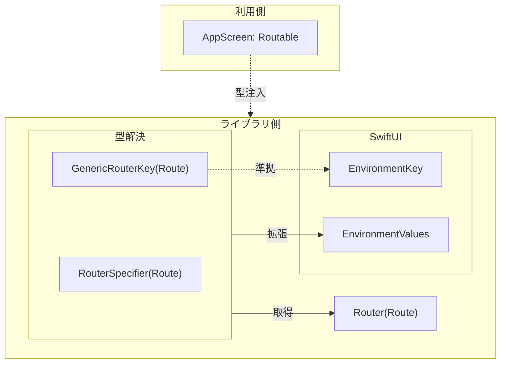

## 目次

1. [はじめに](#1-はじめに)
2. [EnvironmentValuesにジェネリックなプロパティを定義できない問題](#2-environmentvaluesにジェネリックなプロパティを定義できない問題)
3. [標準的なEnvironmentの仕組み](#3-標準的なenvironmentの仕組み)
4. [ジェネリックなEnvironment拡張の実装](#4-ジェネリックなenvironment拡張の実装)
5. [アプリ側での使い方](#5-アプリ側での使い方)
6. [まとめ](#6-まとめ)

---

## 1. はじめに

こんにちは、個人でiOSアプリ開発をしていて、最近では「[読書メモリー](https://apps.apple.com/jp/app/id6751159926)」という本の管理アプリをリリースしました。

SwiftUIで画面遷移を実装するとき、NavigationLinkやnavigationDestinationを使う方法があります。しかし、画面遷移を管理する責務を持ったオブジェクトがいて、そのメソッドを呼ぶことで遷移するという形の方がシンプルだと感じました。`router.navigate(to:)`のような呼び心地のAPIが欲しかったのです。

また、遷移先をenumで定義することで型安全に管理し、その仕組み自体をパッケージ化して複数のプロジェクトで再利用したいと考え、ライブラリを作ることにしました。具体的には、以下のようなAPIを目指しました。

```swift
// 遷移先をenumで定義
enum AppRoute: Routable {
    case detail(id: String)
    case settings
}

// メソッド呼び出しで画面遷移
Button("詳細へ") {
    router.navigate(to: .detail(id: "123"))
}
```

このAPIを実現するにあたり、EnvironmentをジェネリックにDIする仕組みが必要になりました。試行錯誤した結果、Generic Subscriptsを`EnvironmentValues`に定義し、Implicit Member Expressionを活用する方法にたどり着きました。本記事では、その設計パターンを解説します。

なお、この実装にあたっては[Miwaさんの記事](https://zenn.dev/en3_hcl/articles/a95baa341d586c)を参考にしました。

---

## 2. EnvironmentValuesにジェネリックなプロパティを定義できない問題

ライブラリ側では、ルーティングを管理する`Router`クラスを提供します。

```swift
// ライブラリ側で定義
@Observable
public final class Router<Route: Routable> {
    public var path: [Route] = []

    public func navigate(to route: Route) {
        path.append(route)
    }
}
```

この`Router`をEnvironment経由でDIしたいのですが、`EnvironmentValues`のextensionでジェネリックなプロパティは定義できません。

```swift
extension EnvironmentValues {
    // これはコンパイルエラー
    var router<Route: Routable>: Router<Route> { ... }
}
```

`any`（existential type）を使う方法も考えられますが、今回のRouterでは使えません。利用側で定義した`enum`のケース（`.detail(id:)`や`.settings`など）にアクセスする必要があり、existential typeでは具体的な型情報が失われるためです。

本記事では、`subscript`を使ってジェネリックなアクセスを実現するパターンを紹介します。

---

## 3. 標準的なEnvironmentの仕組み

SwiftUIのEnvironmentは、View階層を通じて値を伝播させる仕組みです。カスタム値を追加するには、`EnvironmentKey`と`EnvironmentValues`の拡張を定義します。

```swift
// 1. EnvironmentKeyを定義
struct MyValueKey: EnvironmentKey {
    static let defaultValue: String = "default"
}

// 2. EnvironmentValuesを拡張
extension EnvironmentValues {
    var myValue: String {
        get { self[MyValueKey.self] }
        set { self[MyValueKey.self] = newValue }
    }
}

// 3. View内で取得
struct ContentView: View {
    @Environment(\.myValue) private var myValue
    // ...
}
```

この仕組みは具体的な型が決まっている場合には問題なく機能します。しかし、ライブラリ側で具体型を書けない場合、`EnvironmentKey`の`defaultValue`や`EnvironmentValues`のプロパティに型を指定できません。

---

## 4. ジェネリックなEnvironment拡張の実装

`EnvironmentValues`のextensionにジェネリックなプロパティは定義できませんが、型パラメータを持つ`subscript`（[Generic Subscripts](https://github.com/swiftlang/swift-evolution/blob/main/proposals/0148-generic-subscripts.md)）は定義できます。これを活用して、利用側で定義した具体型をライブラリ側のジェネリック型に注入する仕組みを作ります。



### 4.1 型指定子（Specifier）パターン

まず、ジェネリック型を識別するための「型指定子」を定義します。

```swift
struct RouterSpecifier<Route: Routable>: Hashable {
    init() {}

    func hash(into hasher: inout Hasher) {
        // 型そのものをハッシュ化
        hasher.combine(ObjectIdentifier(Route.self))
    }

    static func == (lhs: Self, rhs: Self) -> Bool {
        true  // 同じ型パラメータなら常に等しい
    }
}
```

`ObjectIdentifier(Route.self)`がポイントです。Swiftの型はそれぞれ一意の`ObjectIdentifier`を持つため、これをハッシュに使うことで、`RouterSpecifier<AppScreen>`と`RouterSpecifier<SettingsScreen>`を区別できます。

### 4.2 ジェネリックEnvironmentKey

型パラメータごとに異なる`EnvironmentKey`を定義します。

```swift
struct GenericRouterKey<Route: Routable>: EnvironmentKey {
    static var defaultValue: Router<Route> {
        Router<Route>()
    }
}
```

`GenericRouterKey<AppScreen>`と`GenericRouterKey<SettingsScreen>`は別々の`EnvironmentKey`として扱われます。

### 4.3 カスタムsubscriptによるEnvironmentValuesの拡張

通常の`subscript(_:)`はKeyPath経由でアクセスしますが、型指定子を受け取るカスタム`subscript`を定義します。

```swift
extension EnvironmentValues {
    subscript<Route: Routable>(router specifier: RouterSpecifier<Route>) -> Router<Route> {
        get { self[GenericRouterKey<Route>.self] }
        set { self[GenericRouterKey<Route>.self] = newValue }
    }
}
```

これにより、`environmentValues[router: RouterSpecifier<AppScreen>()]`のような形式でアクセスできます。型パラメータ`Route`から適切な`GenericRouterKey<Route>`が自動的に選択されます。

### 4.4 Implicit Member Expressionを活用したAPIの簡潔化

最後に、`@Environment(.router(AppScreen.self))`という記法を実現します。

`Environment`の初期化子を拡張し、`RouterEnvironmentKey<Route>`を受け取れるようにします。

```swift
public struct RouterEnvironmentKey<Route: Routable> {
    fileprivate let specifier: RouterSpecifier<Route>

    fileprivate init() {
        self.specifier = RouterSpecifier<Route>()
    }
}

public extension Environment {
    init<Route: Routable>(_ key: RouterEnvironmentKey<Route>) where Value == Router<Route> {
        self.init(\.[router: key.specifier])
    }
}
```

これで`@Environment(RouterEnvironmentKey<AppScreen>())`と書けるようになりますが、冗長です。

Swiftでは、型が推論できる文脈でstaticメソッドを呼ぶとき、型名を省略してドットから始める記法（[Implicit Member Expression](https://github.com/swiftlang/swift-evolution/blob/main/proposals/0287-implicit-member-chains.md)）が使えます。`RouterEnvironmentKey`にstaticメソッドを追加することで、`.router(AppScreen.self)`という簡潔な記法が可能になります。

```swift
public extension RouterEnvironmentKey {
    static func router(_ type: Route.Type) -> RouterEnvironmentKey<Route> {
        RouterEnvironmentKey<Route>()
    }
}
```

これで、以下の記法が使えるようになります。

```swift
@Environment(.router(AppScreen.self)) private var router
```

---

## 5. アプリ側での使い方

### 5.1 Routableの実装

アプリ側で画面遷移先を定義します。

```swift
enum AppScreen: Routable {
    case profile(userId: String)
    case settings
    case detail(item: Item)

    var body: some View {
        switch self {
        case .profile(let userId):
            ProfileView(userId: userId)
        case .settings:
            SettingsView()
        case .detail(let item):
            DetailView(item: item)
        }
    }
}
```

### 5.2 Routerの注入

アプリのルートでRouterをEnvironmentに注入します。

```swift
@main
struct MyApp: App {
    @State private var router = Router<AppScreen>()

    var body: some Scene {
        WindowGroup {
            ContentView()
                .environment(router)
        }
    }
}
```

### 5.3 View内での使用

任意のViewからRouterを取得し、画面遷移を実行できます。

```swift
struct HomeView: View {
    @Environment(.router(AppScreen.self)) private var router

    var body: some View {
        VStack {
            Button("プロフィールを表示") {
                router.navigate(to: .profile(userId: "123"))
            }

            Button("設定を開く") {
                router.navigate(to: .settings)
            }
        }
    }
}
```

---

## 6. まとめ

ジェネリック型をEnvironmentで管理するため、以下の3つの要素を組み合わせました。

| 要素 | 役割 |
|---|---|
| **型指定子（Specifier）** | `ObjectIdentifier`で型を識別し、Hashableに準拠 |
| **カスタムsubscript** | 型パラメータから適切なEnvironmentKeyを選択 |
| **Implicit Member Expression** | `@Environment(.router(Type.self))`の記法を実現 |

このパターンはRouter以外にも応用できます。SheetやAlertの表示管理など、ジェネリック型をEnvironmentで扱いたい場面で同じ設計が使えます。

ライブラリ開発でSwiftUIのEnvironmentを拡張する際の参考になれば幸いです。

---

## 参考リンク

### 参考にした記事
- [[SwiftUI] ジェネリックな@Environment / EnvironmentValueを追加する](https://zenn.dev/en3_hcl/articles/a95baa341d586c)

### 本記事で紹介したライブラリ
- [swift-ui-routing](https://github.com/no-problem-dev/swift-ui-routing) - SwiftUIの画面遷移をプログラマティックに管理

### 実践アプリ
- [読書メモリー - App Store](https://apps.apple.com/jp/app/id6751159926) - 本記事のパターンを採用した個人開発アプリ

### 著者
- [GitHub](https://github.com/taniguchi-kyoichi)
