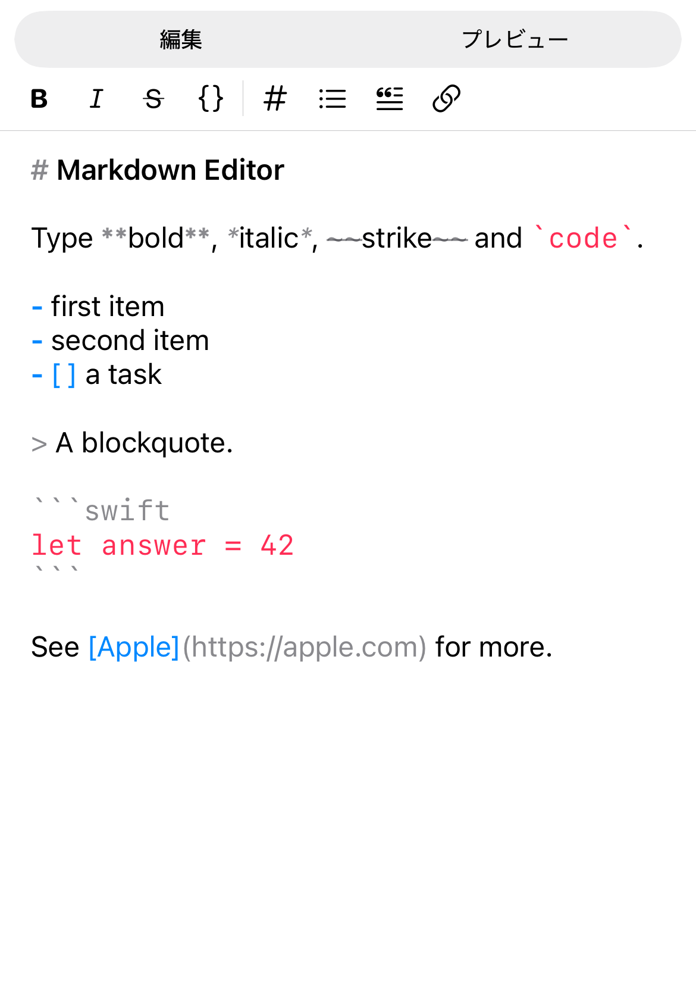
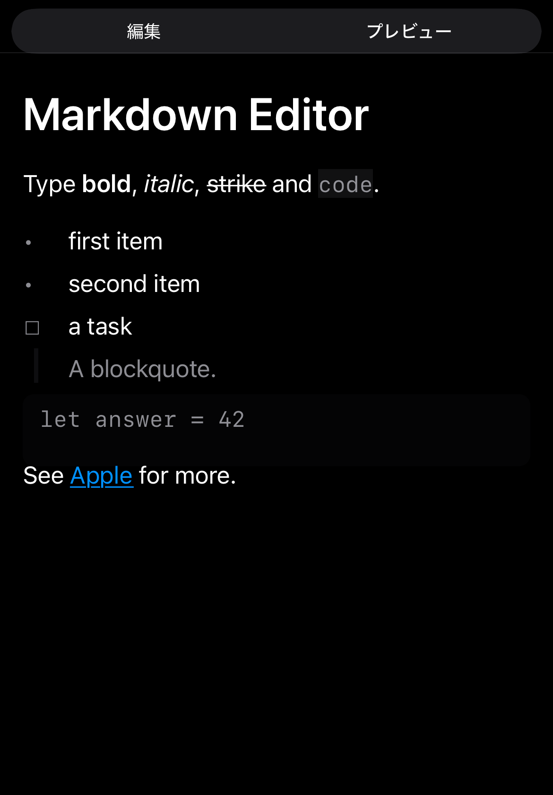
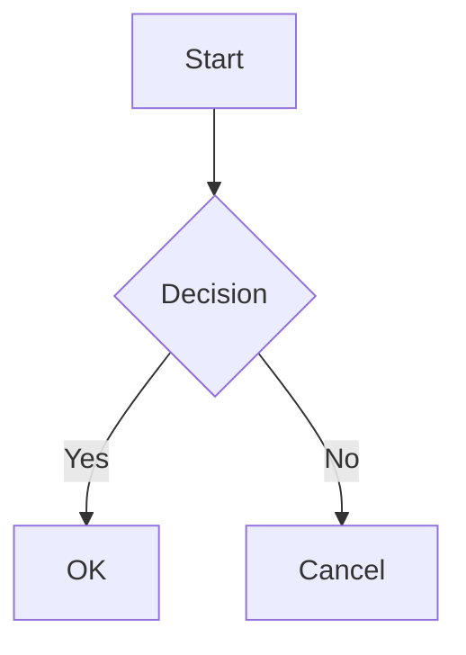

# SwiftMarkdownView

[English](./README.md) | 日本語

**iOS と macOS の両方で動く Markdown ライブ編集**と、その土台のレンダラ。

`MarkdownEditor` はライブシンタックスハイライト・差し替え可能なフォーマットツールバー・
入力ルール・macOS の分割プレビューを備えた SwiftUI エディタ。`MarkdownView` は
ドキュメント全体を 1 つの TextKit 2 テキストビューに描画するため、ブロックを跨いで
選択でき、コピーすると読めるテキストが得られる。


| 編集中（ライト） | プレビュー（ダーク） |
|---|---|
|  |  |

## 特徴

- **両 OS で動くエディタ**: iOS と macOS で同じ `MarkdownEditor`。macOS 側は互換のための
  張りぼてではなく `NSTextView` の完全実装
- **編集をカスタマイズできる**: ツールバーを項目配列で組む、独自コントローラを注入する、
  プログラムからコマンドを送る、入力ルールを足す — [エディタ](#エディタ)を参照
- **連続選択**: ドキュメント全体を 1 つのテキストビューに描画するため、ブロックを跨いで
  選択でき、コピーすると読めるテキストが得られる
- **ライブプレビュー**: 編集中にインラインマーカーを隠してその場で描画する（Notion 風）。
  プレーンな `.md` 文字列が唯一の正であることは変わらない
- **豊富な要素**: テーブル、タスクリスト、画像、Mermaid ダイアグラム、数式（LaTeX）、Aside
- **オプションのシンタックスハイライト**: 別モジュールで 50+ 言語対応（HighlightJS）
- **デザインシステムに縛られない**: 色・寸法・文字サイズは自分で実装するただのプロトコル。
  既定はシステムの意味色で、ライト/ダークに自動追従する

## クイックスタート

```swift
import SwiftUI
import SwiftMarkdownView

struct ContentView: View {
    var body: some View {
        MarkdownView("""
        # Hello, Markdown!

        This is a **bold** and *italic* text.

        ```swift
        let greeting = "Hello, World!"
        print(greeting)
        ```

        - [x] Task completed
        - [ ] Task pending
        """)
    }
}
```

## インストール

### Swift Package Manager

`Package.swift` に以下を追加:

```swift
dependencies: [
    .package(url: "https://github.com/no-problem-dev/swift-markdown-view.git", from: "3.0.0")
]
```

ターゲットに追加:

```swift
.target(
    name: "YourTarget",
    dependencies: [
        .product(name: "SwiftMarkdownView", package: "swift-markdown-view"),
        // シンタックスハイライトを使用する場合（オプション）
        .product(name: "SwiftMarkdownViewHighlightJS", package: "swift-markdown-view")
    ]
)
```

## サポート要素

### ブロック要素

| 要素 | Markdown | 備考 |
|------|----------|------|
| 見出し | `# H1` ~ `###### H6` | Typography 連携 |
| 段落 | テキスト | |
| コードブロック | ` ```swift ``` ` | オプションでハイライト対応 |
| Aside | `> Note: text` | 24 種類 + カスタム |
| Mermaid | ` ```mermaid ``` ` | iOS 26+ 推奨 |
| 数式 | `$$...$$` / ` ```math ``` ` | LaTeX ディスプレイ数式 |
| 順序なしリスト | `- item` | ネスト対応 |
| 順序付きリスト | `1. item` | ネスト対応 |
| タスクリスト | `- [x] done` | |
| テーブル | `\| col \|` | アライメント対応 |
| 水平線 | `---` | |

### インライン要素

| 要素 | Markdown |
|------|----------|
| 強調（イタリック） | `*text*` |
| 太字 | `**text**` |
| インラインコード | `` `code` `` |
| リンク | `[text](url)` |
| 画像 | `` |
| 取り消し線 | `~~text~~` |
| インライン数式 | `$...$` / `\(...\)` |

## エディタ

`MarkdownEditor` はプレーンな `String` にバインドする。行き来のための中間ドキュメントモデルは
無く、Markdown テキストそのものが状態。

```swift
import SwiftUI
import SwiftMarkdownEditor

struct EditorScreen: View {
    @State private var text = "# 下書き\n\n書き始める。"

    var body: some View {
        MarkdownEditor(text: $text)
    }
}
```

`livePreview: true` にすると、入力中にインラインマーカーを隠してその場で描画する。
キャレットのある行だけはマーカーが残るので、そこは編集できる。

### ツールバー

ツールバーは項目の順序付き配列。`.standard` が既定の構成で、その一部を取って独自コマンドを
足すこともできる:

```swift
MarkdownEditor(text: $text, toolbar: [
    .bold, .italic,
    .separator,
    .item(icon: "highlighter", label: "マーカー", key: "h") { controller in
        guard let state = controller.state else { return }
        controller.apply(MarkdownFormatting.wrap(
            text: state.text, selection: state.selection, delimiter: "=="
        ))
    }
])
```

`label` は省略できない。アイコンだけのボタンには読み上げ名が無く、付けないと VoiceOver
利用者には区別のつかないボタンが並ぶことになる。`key` を渡すとキーボードショートカットが
付き、macOS とハードウェアキーボードのある iPad で効く。ショートカットは項目定義から
供給されるので、ツールバーを差し替えても黙って失われることはない。`[]` を渡すと
ツールバーを表示しない。

### 自前の UI から操作する

コントローラを注入すればどこからでもコマンドを送れる。`mode` を Binding にすると
現在の表示モードを観測・変更できる:

```swift
struct EditorScreen: View {
    @State private var text = ""
    @State private var mode: MarkdownEditorMode = .edit
    @StateObject private var controller = MarkdownEditorController()

    var body: some View {
        VStack {
            Button("太字") { controller.toggleBold() }
            MarkdownEditor(text: $text, mode: $mode, toolbar: [], controller: controller)
        }
    }
}
```

`controller.state` で現在のテキストと選択が取れ、`controller.apply(_:)` で `EditTransform` を
適用する。`MarkdownFormatting` の純関数と組み合わせれば、任意のコマンドが書ける。
undo / redo はシステムの `UndoManager` が担うので、独自コマンドも何もしなくても取り消せる。

### 入力ルール

入力ルールは打鍵に合わせて走る — Return でリストを継続する、`*` を打つと選択を囲む、など。
`InputRule` に適合すれば独自のルールを足せる:

```swift
struct MyRule: InputRule {
    func transform(state: EditorState, inserting text: String, replacing range: TextSpan) -> RuleTransform? {
        // nil を返すと次のルールに回る
    }
}

MarkdownEditor(
    text: $text,
    inputRules: InputRuleProcessor(rules: [MyRule()] + InputRuleProcessor.standard.rules)
)
```

ルールは順に試され、最初に一致したものが勝つ。

### エディタのテーマ

ソースの着色は `MarkdownEditorTheme` から来る。既定はシステムの意味色で構成されており、
ライト/ダークに自動追従する。トークン単位で変えることも、4 つの役割から組み立てることもできる:

```swift
var theme = MarkdownEditorTheme.light
theme.styles[.linkURL] = .init(color: .systemPurple, italic: true)

MarkdownEditor(text: $text)
    .markdownEditorTheme(theme)
```

## シンタックスハイライト

### デフォルト動作

デフォルトでは、コードブロックはハイライトなしで表示する。

### HighlightJS によるハイライト

50+ 言語に対応したシンタックスハイライトを有効にするには、オプションモジュールを使用する:

```swift
import SwiftMarkdownView
import SwiftMarkdownViewHighlightJS

// 推奨: アダプティブハイライト（ライト/ダークモード自動対応）
MarkdownView(source)
    .adaptiveSyntaxHighlighting()

// テーマ指定
MarkdownView(source)
    .adaptiveSyntaxHighlighting(theme: .github)

// 手動設定
MarkdownView(source)
    .markdownSyntaxHighlighter(
        HighlightJSSyntaxHighlighter(theme: .atomOne, colorMode: .dark)
    )
```

**利用可能なテーマ**: `.a11y`（アクセシビリティ推奨）、`.xcode`、`.github`、`.atomOne`、`.solarized`、`.tokyoNight`

### カスタムハイライター

独自のハイライトロジックを実装できる:

```swift
struct MyHighlighter: SyntaxHighlighter {
    func highlight(_ code: String, language: String?) async throws -> AttributedString {
        var result = AttributedString(code)
        // カスタム実装
        return result
    }
}

MarkdownView(source)
    .markdownSyntaxHighlighter(MyHighlighter())
```

## Aside（コールアウト）

ブロッククォートを解釈し、Note、Warning、Tip などのコールアウトとして表示する。

```swift
MarkdownView("""
> Note: これは補足情報です。

> Warning: 注意が必要な内容です。

> Tip: 便利なヒントです。
""")
```

**対応種類**: `Note`, `Tip`, `Important`, `Warning`, `Experiment`, `Attention`, `Bug`, `ToDo`, `SeeAlso`, `Throws` など 24 種類 + カスタム

## Mermaid ダイアグラム

コードブロックの言語に `mermaid` を指定すると、ダイアグラムとしてレンダリングする。

```swift
MarkdownView("""

""")
```

**対応ダイアグラム**: flowchart、sequence、class、state、gantt、journey、timeline、mindmap

**動作環境**:
- iOS 26+、macOS 26+: WebKit によるネイティブレンダリング
- それ以前: フォールバック表示（コードブロックとして表示）

## テーマ

既定はシステムの意味色なので、設定なしでライト/ダークどちらでも文字が読める。
自分のデザインに合わせるには `MarkdownPalette` を実装する。外部依存は関わらない:

```swift
import SwiftMarkdownView

struct BrandPalette: MarkdownPalette {
    var text: Color { .primary }
    var secondaryText: Color { .secondary }
    var heading: Color { .indigo }
    var link: Color { .blue }
    var codeBackground: Color { Color.gray.opacity(0.12) }
    var rule: Color { Color.gray.opacity(0.4) }
}

MarkdownView("# Themed Markdown")
    .markdownPalette(BrandPalette())
```

`MarkdownMetrics`（段落間隔・インデント幅）と `MarkdownTypeScale`（本文と見出しのサイズ）も
同様に `.markdownMetrics(_:)` / `.markdownTypeScale(_:)` で差し替える。

### swift-design-system を使う場合

アプリが既に `swift-design-system` を使っているなら、`SwiftMarkdownViewDesignSystem` product を
追加すれば Markdown がアプリテーマに追従する:

```swift
import DesignSystem
import SwiftMarkdownView
import SwiftMarkdownViewDesignSystem

MarkdownView("# Themed Markdown")
    .markdownTheme(themeProvider)
```

エディタ側は `SwiftMarkdownEditorDesignSystem` の `.markdownEditorDesignSystemTheme()`。

> `swift-design-system` はパッケージの依存としては今も解決される（オプションのブリッジ・
> LaTeX・カタログが使うため）。変わったのは `SwiftMarkdownView` と `SwiftMarkdownEditor` が
> それをリンクも公開もしなくなった点で、利用者のコードがその型に触れる必要はない。

## モジュール構成

| モジュール | 役割 |
|-----------|------|
| `SwiftMarkdownView` | SwiftUI ビューエントリーポイント。`MarkdownModel`・`MarkdownAttributedKit` を内包（再エクスポート） |
| `SwiftMarkdownEditor` | ライブプレビュー付き Markdown エディタ |
| `SwiftMarkdownViewHighlightJS` | オプションの HighlightJS シンタックスハイライト |
| `SwiftMarkdownViewLaTeX` | オプションの LaTeX 数式レンダリング |
| `SwiftMarkdownViewDesignSystem` | `swift-design-system` のトークンを Markdown のテーマへ写すオプションのブリッジ |
| `SwiftMarkdownEditorDesignSystem` | エディタのテーマ向けの同ブリッジ |
| `SwiftMarkdownViewCatalog` | 対応要素を一通り描画して見せるデモ画面。ライブラリの利用には不要 |

## 依存関係

| パッケージ | 用途 | 必須 |
|-----------|------|------|
| [swift-markdown](https://github.com/swiftlang/swift-markdown) | Markdown パーシング | ✅ |
| [swift-design-system](https://github.com/no-problem-dev/swift-design-system) | デザイントークン。ブリッジ・LaTeX・カタログが使う | オプション |
| [HighlightSwift](https://github.com/appstefan/HighlightSwift) | シンタックスハイライト | `SwiftMarkdownViewHighlightJS` 利用時のみ |
| [swift-latex-view](https://github.com/no-problem-dev/swift-latex-view) | LaTeX 組版（[SwiftMath](https://github.com/mgriebling/SwiftMath) を推移的に含む） | `SwiftMarkdownViewLaTeX` 利用時のみ |
| [swift-visual-testing](https://github.com/no-problem-dev/swift-visual-testing) | スナップショットテスト | テスト時のみ |
| [swift-docc-plugin](https://github.com/apple/swift-docc-plugin) | ドキュメント生成 | ビルドツールのみ |

`SwiftMarkdownView` と `SwiftMarkdownEditor` は `swift-design-system` をリンクしない。
パッケージ全体としては依存の解決は走るが、利用者のコードがその型に触れる必要はない。

## サンプル

動かせるサンプルアプリが [`Examples/`](./Examples) にある。

- [`MarkdownPlayground`](./Examples/MarkdownPlayground) — iOS / macOS アプリ。3 タブ構成で、
  **エディタ**（独自ツールバー項目・コントローラ注入・モード観測）、要素カタログ、
  ブロックを跨いだ選択のショーケース
- [`ZennArticleSwiftUI`](./Examples/ZennArticleSwiftUI) — 実際の長文記事を描画する例

## ドキュメント

- **API リファレンス**: [DocC ドキュメント](https://no-problem-dev.github.io/swift-markdown-view/documentation/swiftmarkdownview/)

## ライセンス

MIT License — 詳細は [LICENSE](LICENSE) を参照。
