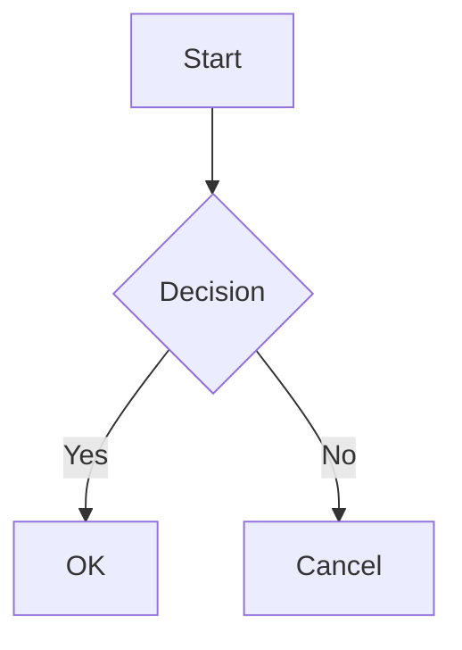

# SwiftMarkdownView

[English](./README.md) | 日本語

SwiftUI ネイティブな Markdown レンダリングライブラリ。DesignSystem と統合し、美しい Markdown 表示を実現する。


## 特徴

- **SwiftUI ネイティブ**: `NSTextStorage` + TextKit 2 による高性能レンダリング
- **DesignSystem 統合**: ColorPalette、Typography、Spacing とシームレスに連携
- **オプションのシンタックスハイライト**: 別モジュールで 50+ 言語対応（HighlightJS）
- **豊富な要素サポート**: テーブル、タスクリスト、画像、Mermaid ダイアグラム、数式（LaTeX）等
- **カスタマイズ可能**: 環境値を通じたスタイル設定

## クイックスタート

```swift
import SwiftUI
import SwiftMarkdownView

struct ContentView: View {
    var body: some View {
        MarkdownView("""
        # Hello, Markdown!

        This is a **bold** and *italic* text.

        ```swift
        let greeting = "Hello, World!"
        print(greeting)
        ```

        - [x] Task completed
        - [ ] Task pending
        """)
    }
}
```

## インストール

### Swift Package Manager

`Package.swift` に以下を追加:

```swift
dependencies: [
    .package(url: "https://github.com/no-problem-dev/swift-markdown-view.git", from: "3.0.0")
]
```

ターゲットに追加:

```swift
.target(
    name: "YourTarget",
    dependencies: [
        .product(name: "SwiftMarkdownView", package: "swift-markdown-view"),
        // シンタックスハイライトを使用する場合（オプション）
        .product(name: "SwiftMarkdownViewHighlightJS", package: "swift-markdown-view")
    ]
)
```

## サポート要素

### ブロック要素

| 要素 | Markdown | 備考 |
|------|----------|------|
| 見出し | `# H1` ~ `###### H6` | Typography 連携 |
| 段落 | テキスト | |
| コードブロック | ` ```swift ``` ` | オプションでハイライト対応 |
| Aside | `> Note: text` | 24 種類 + カスタム |
| Mermaid | ` ```mermaid ``` ` | iOS 26+ 推奨 |
| 数式 | `$$...$$` / ` ```math ``` ` | LaTeX ディスプレイ数式 |
| 順序なしリスト | `- item` | ネスト対応 |
| 順序付きリスト | `1. item` | ネスト対応 |
| タスクリスト | `- [x] done` | |
| テーブル | `\| col \|` | アライメント対応 |
| 水平線 | `---` | |

### インライン要素

| 要素 | Markdown |
|------|----------|
| 強調（イタリック） | `*text*` |
| 太字 | `**text**` |
| インラインコード | `` `code` `` |
| リンク | `[text](url)` |
| 画像 | `` |
| 取り消し線 | `~~text~~` |
| インライン数式 | `$...$` / `\(...\)` |

## シンタックスハイライト

### デフォルト動作

デフォルトでは、コードブロックはハイライトなしで表示する。

### HighlightJS によるハイライト

50+ 言語に対応したシンタックスハイライトを有効にするには、オプションモジュールを使用する:

```swift
import SwiftMarkdownView
import SwiftMarkdownViewHighlightJS

// 推奨: アダプティブハイライト（ライト/ダークモード自動対応）
MarkdownView(source)
    .adaptiveSyntaxHighlighting()

// テーマ指定
MarkdownView(source)
    .adaptiveSyntaxHighlighting(theme: .github)

// 手動設定
MarkdownView(source)
    .syntaxHighlighter(
        HighlightJSSyntaxHighlighter(theme: .atomOne, colorMode: .dark)
    )
```

**利用可能なテーマ**: `.a11y`（アクセシビリティ推奨）、`.xcode`、`.github`、`.atomOne`、`.solarized`、`.tokyoNight`

### カスタムハイライター

独自のハイライトロジックを実装できる:

```swift
struct MyHighlighter: SyntaxHighlighter {
    func highlight(_ code: String, language: String?) async throws -> AttributedString {
        var result = AttributedString(code)
        // カスタム実装
        return result
    }
}

MarkdownView(source)
    .syntaxHighlighter(MyHighlighter())
```

## Aside（コールアウト）

ブロッククォートを解釈し、Note、Warning、Tip などのコールアウトとして表示する。

```swift
MarkdownView("""
> Note: これは補足情報です。

> Warning: 注意が必要な内容です。

> Tip: 便利なヒントです。
""")
```

**対応種類**: `Note`, `Tip`, `Important`, `Warning`, `Experiment`, `Attention`, `Bug`, `ToDo`, `SeeAlso`, `Throws` など 24 種類 + カスタム

## Mermaid ダイアグラム

コードブロックの言語に `mermaid` を指定すると、ダイアグラムとしてレンダリングする。

```swift
MarkdownView("""

""")
```

**対応ダイアグラム**: flowchart、sequence、class、state、gantt、journey、timeline、mindmap

**動作環境**:
- iOS 26+、macOS 26+: WebKit によるネイティブレンダリング
- それ以前: フォールバック表示（コードブロックとして表示）

## DesignSystem テーマの適用

`ThemeProvider` を View 階層に適用すると、カラー・タイポグラフィ・スペーシングの
全デザイントークンがそこから解決される。

```swift
import DesignSystem
import SwiftMarkdownView

struct ContentView: View {
    @State private var theme = ThemeProvider(initialMode: .dark)

    var body: some View {
        MarkdownView("# Themed Markdown")
            .theme(theme)
    }
}
```

テーマ全体ではなく単一のトークンだけ差し替えたい場合は、具象型を注入する。

```swift
MarkdownView("# Themed Markdown")
    .environment(\.colorPalette, DarkColorPalette())
```

## モジュール構成

| モジュール | 役割 |
|-----------|------|
| `SwiftMarkdownView` | SwiftUI ビューエントリーポイント。`MarkdownModel`・`MarkdownAttributedKit` を内包（再エクスポート） |
| `SwiftMarkdownViewHighlightJS` | オプションの HighlightJS シンタックスハイライト |
| `SwiftMarkdownViewLaTeX` | オプションの LaTeX 数式レンダリング |
| `SwiftMarkdownEditor` | ライブプレビュー付き Markdown エディタ |

## 依存関係

| パッケージ | 用途 | 必須 |
|-----------|------|------|
| [swift-markdown](https://github.com/swiftlang/swift-markdown) | Markdown パーシング | ✅ |
| [swift-design-system](https://github.com/no-problem-dev/swift-design-system) | デザイントークン | ✅ |
| [HighlightSwift](https://github.com/appstefan/HighlightSwift) | シンタックスハイライト | オプション |

## ドキュメント

- **API リファレンス**: [DocC ドキュメント](https://no-problem-dev.github.io/swift-markdown-view/documentation/swiftmarkdownview/)

## ライセンス

MIT License — 詳細は [LICENSE](LICENSE) を参照。
