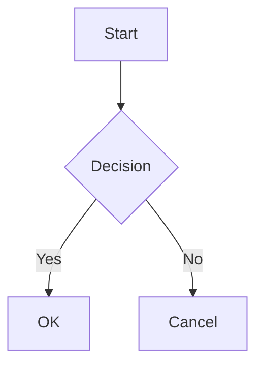

# SwiftMarkdownView

[English](README_EN.md) | 日本語

SwiftUIネイティブなMarkdownレンダリングライブラリ。DesignSystemと統合し、美しいMarkdown表示を実現します。


## 特徴

- **SwiftUIネイティブ**: `AttributedString`と`Text`連結による高性能レンダリング
- **DesignSystem統合**: ColorPalette、Typography、Spacingとシームレスに連携
- **オプションのシンタックスハイライト**: 別モジュールで50+言語対応（HighlightJS）
- **豊富な要素サポート**: テーブル、タスクリスト、画像、Mermaidダイアグラム等
- **カスタマイズ可能**: 環境値を通じたスタイル設定

## クイックスタート

```swift
import SwiftUI
import SwiftMarkdownView

struct ContentView: View {
    var body: some View {
        MarkdownView("""
        # Hello, Markdown!

        This is a **bold** and *italic* text.

        ```swift
        let greeting = "Hello, World!"
        print(greeting)
        ```

        - [x] Task completed
        - [ ] Task pending
        """)
    }
}
```

## インストール

### Swift Package Manager

`Package.swift` に以下を追加：

```swift
dependencies: [
    .package(url: "https://github.com/no-problem-dev/swift-markdown-view.git", from: "1.0.0")
]
```

ターゲットに追加：

```swift
.target(
    name: "YourTarget",
    dependencies: [
        .product(name: "SwiftMarkdownView", package: "swift-markdown-view"),
        // シンタックスハイライトを使用する場合（オプション）
        .product(name: "SwiftMarkdownViewHighlightJS", package: "swift-markdown-view")
    ]
)
```

## サポート要素

### ブロック要素

| 要素 | Markdown | 備考 |
|------|----------|------|
| 見出し | `# H1` ~ `###### H6` | Typography連携 |
| 段落 | テキスト | |
| コードブロック | ` ```swift ``` ` | オプションでハイライト対応 |
| Aside | `> Note: text` | 24種類 + カスタム |
| Mermaid | ` ```mermaid ``` ` | iOS 26+推奨 |
| 順序なしリスト | `- item` | ネスト対応 |
| 順序付きリスト | `1. item` | ネスト対応 |
| タスクリスト | `- [x] done` | |
| テーブル | `\| col \|` | アライメント対応 |
| 水平線 | `---` | |

### インライン要素

| 要素 | Markdown |
|------|----------|
| 強調（イタリック） | `*text*` |
| 太字 | `**text**` |
| インラインコード | `` `code` `` |
| リンク | `[text](url)` |
| 画像 | `` |
| 取り消し線 | `~~text~~` |

## シンタックスハイライト

### デフォルト動作

デフォルトでは`PlainTextHighlighter`が使用され、コードブロックはハイライトなしで表示されます。

### HighlightJSによるハイライト

50+言語に対応したシンタックスハイライトを有効にするには、オプションモジュールを使用します：

```swift
import SwiftMarkdownView
import SwiftMarkdownViewHighlightJS

// 推奨：アダプティブハイライト（ライト/ダークモード自動対応）
MarkdownView(source)
    .adaptiveSyntaxHighlighting()

// テーマ指定
MarkdownView(source)
    .adaptiveSyntaxHighlighting(theme: .github)

// 手動設定
MarkdownView(source)
    .syntaxHighlighter(
        HighlightJSSyntaxHighlighter(theme: .atomOne, colorMode: .dark)
    )
```

**利用可能なテーマ**: `.a11y`（アクセシビリティ推奨）、`.xcode`、`.github`、`.atomOne`、`.solarized`、`.tokyoNight`

### カスタムハイライター

独自のハイライトロジックを実装できます：

```swift
struct MyHighlighter: SyntaxHighlighter {
    func highlight(_ code: String, language: String?) async throws -> AttributedString {
        var result = AttributedString(code)
        // カスタム実装
        return result
    }
}

MarkdownView(source)
    .syntaxHighlighter(MyHighlighter())
```

## Aside（コールアウト）

ブロッククォートを解釈し、Note、Warning、Tipなどのコールアウトとして表示します。

```swift
MarkdownView("""
> Note: これは補足情報です。

> Warning: 注意が必要な内容です。

> Tip: 便利なヒントです。
""")
```

**対応種類**: `Note`, `Tip`, `Important`, `Warning`, `Experiment`, `Attention`, `Bug`, `ToDo`, `SeeAlso`, `Throws` など24種類 + カスタム

### カスタムAsideスタイル

```swift
struct MyAsideStyle: AsideStyle {
    func icon(for kind: AsideKind) -> String {
        switch kind {
        case .warning: return "flame.fill"
        default: return DefaultAsideStyle().icon(for: kind)
        }
    }

    func accentColor(for kind: AsideKind, colorPalette: any ColorPalette) -> Color {
        switch kind {
        case .tip: return .mint
        default: return DefaultAsideStyle().accentColor(for: kind, colorPalette: colorPalette)
        }
    }

    func backgroundColor(for kind: AsideKind, colorPalette: any ColorPalette) -> Color {
        accentColor(for: kind, colorPalette: colorPalette).opacity(0.15)
    }

    func titleColor(for kind: AsideKind, colorPalette: any ColorPalette) -> Color {
        accentColor(for: kind, colorPalette: colorPalette)
    }
}

MarkdownView(source)
    .asideStyle(MyAsideStyle())
```

## Mermaidダイアグラム

コードブロックの言語に`mermaid`を指定すると、ダイアグラムとしてレンダリングされます。

```swift
MarkdownView("""

""")
```

**対応ダイアグラム**: flowchart、sequence、class、state、gantt、journey、timeline、mindmap

**動作環境**:
- iOS 26+、macOS 26+: WebKitによるネイティブレンダリング
- それ以前: フォールバック表示（コードブロックとして表示）

## DesignSystemテーマの適用

```swift
MarkdownView("# Themed Markdown")
    .environment(\.colorPalette, .dark)
    .environment(\.typographyScale, .large)
```

## 依存関係

| パッケージ | 用途 | 必須 |
|-----------|------|------|
| [swift-markdown](https://github.com/swiftlang/swift-markdown) | Markdownパーシング | ✅ |
| [swift-design-system](https://github.com/no-problem-dev/swift-design-system) | デザイントークン | ✅ |
| [HighlightSwift](https://github.com/nicklockwood/HighlightSwift) | シンタックスハイライト | オプション |

## ドキュメント

詳細なAPIドキュメントは [GitHub Pages](https://no-problem-dev.github.io/swift-markdown-view/documentation/swiftmarkdownview/) で確認できます。

## ライセンス

MIT License - 詳細は [LICENSE](LICENSE) を参照してください。
