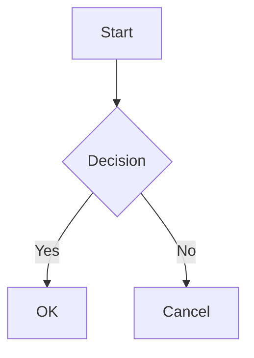

# SwiftMarkdownView

English | [日本語](./README.ja.md)

**Markdown live editing that works on both iOS and macOS** — plus the renderer it is built on.

`MarkdownEditor` is a SwiftUI editor with live syntax highlighting, a customizable formatting
toolbar, input rules, and a side-by-side preview on macOS. `MarkdownView` renders the whole
document into a single TextKit 2 text view, so selection runs across blocks and Copy yields
readable text.


| Editing (light) | Rendered preview (dark) |
|---|---|
|  |  |

## Features

- **Editor on both platforms**: one `MarkdownEditor` for iOS and macOS. The macOS side is a full
  `NSTextView` implementation, not a compatibility shim
- **Customizable editing**: build the toolbar from an item array, inject your own controller, drive
  commands programmatically, add input rules — see [Editor](#editor)
- **Continuous selection**: the whole document renders into one text view, so selection runs across
  blocks and Copy yields readable text
- **Live preview**: hide inline markers and render in place while editing (Notion style). The plain
  `.md` string stays the single source of truth
- **Rich elements**: tables, task lists, images, Mermaid diagrams, math (LaTeX), asides
- **Optional syntax highlighting**: 50+ languages via a separate HighlightJS module
- **No design-system lock-in**: colors, metrics, and type sizes are plain protocols you implement.
  Defaults use system semantic colors and adapt to light/dark automatically

## Quick Start

```swift
import SwiftUI
import SwiftMarkdownView

struct ContentView: View {
    var body: some View {
        MarkdownView("""
        # Hello, Markdown!

        This is a **bold** and *italic* text.

        ```swift
        let greeting = "Hello, World!"
        print(greeting)
        ```

        - [x] Task completed
        - [ ] Task pending
        """)
    }
}
```

## Installation

### Swift Package Manager

Add to your `Package.swift`:

```swift
dependencies: [
    .package(url: "https://github.com/no-problem-dev/swift-markdown-view.git", from: "3.0.0")
]
```

Add to your target:

```swift
.target(
    name: "YourTarget",
    dependencies: [
        .product(name: "SwiftMarkdownView", package: "swift-markdown-view"),
        // For syntax highlighting (optional)
        .product(name: "SwiftMarkdownViewHighlightJS", package: "swift-markdown-view")
    ]
)
```

## Supported Elements

### Block Elements

| Element | Markdown | Notes |
|---------|----------|-------|
| Headings | `# H1` ~ `###### H6` | Typography integration |
| Paragraphs | text | |
| Code Blocks | ` ```swift ``` ` | Optional highlighting |
| Asides | `> Note: text` | 24 kinds + custom |
| Mermaid | ` ```mermaid ``` ` | iOS 26+ recommended |
| Math | `$$...$$` / ` ```math ``` ` | LaTeX display math |
| Unordered Lists | `- item` | Nested supported |
| Ordered Lists | `1. item` | Nested supported |
| Task Lists | `- [x] done` | |
| Tables | `\| col \|` | Alignment supported |
| Thematic Breaks | `---` | |

### Inline Elements

| Element | Markdown |
|---------|----------|
| Emphasis (italic) | `*text*` |
| Strong (bold) | `**text**` |
| Inline Code | `` `code` `` |
| Links | `[text](url)` |
| Images | `` |
| Strikethrough | `~~text~~` |
| Inline Math | `$...$` / `\(...\)` |

## Editor

`MarkdownEditor` binds to a plain `String`. There is no intermediate document model to convert
to and from — the Markdown text is the state.

```swift
import SwiftUI
import SwiftMarkdownEditor

struct EditorScreen: View {
    @State private var text = "# Draft\n\nStart writing."

    var body: some View {
        MarkdownEditor(text: $text)
    }
}
```

`livePreview: true` hides inline markers and renders in place while you type; the caret's own line
keeps its markers so you can still edit them.

### Toolbar

The toolbar is an ordered array of items. `.standard` is the built-in set; you can take part of it
and add your own commands:

```swift
MarkdownEditor(text: $text, toolbar: [
    .bold, .italic,
    .separator,
    .item(icon: "highlighter", label: "Highlight", key: "h") { controller in
        guard let state = controller.state else { return }
        controller.apply(MarkdownFormatting.wrap(
            text: state.text, selection: state.selection, delimiter: "=="
        ))
    }
])
```

`label` is required — icon-only buttons have no spoken name, and VoiceOver users would hear a row of
indistinguishable buttons without it. Passing `key` adds a keyboard shortcut, which works on macOS
and on iPad with a hardware keyboard. Shortcuts come from the item definitions, so replacing the
toolbar does not silently drop them. Pass `[]` to hide the toolbar entirely.

### Driving the editor from your own UI

Inject a controller to send commands from anywhere, and bind `mode` to observe or set the current
view mode:

```swift
struct EditorScreen: View {
    @State private var text = ""
    @State private var mode: MarkdownEditorMode = .edit
    @StateObject private var controller = MarkdownEditorController()

    var body: some View {
        VStack {
            Button("Bold") { controller.toggleBold() }
            MarkdownEditor(text: $text, mode: $mode, toolbar: [], controller: controller)
        }
    }
}
```

`controller.state` gives you the current text and selection; `controller.apply(_:)` applies an
`EditTransform`. Together with the pure functions in `MarkdownFormatting`, that is enough to write
any command. Undo and redo are handled by the system `UndoManager`, so your commands are undoable
without extra work.

### Input rules

Input rules run as you type — continuing a list on Return, wrapping a selection when you type `*`.
Add your own by conforming to `InputRule`:

```swift
struct MyRule: InputRule {
    func transform(state: EditorState, inserting text: String, replacing range: TextSpan) -> RuleTransform? {
        // return nil to let the next rule try
    }
}

MarkdownEditor(
    text: $text,
    inputRules: InputRuleProcessor(rules: [MyRule()] + InputRuleProcessor.standard.rules)
)
```

Rules are tried in order and the first match wins.

### Find and replace (macOS)

The source editor enables the standard find bar, but <kbd>⌘F</kbd> is routed through the host
app's Edit menu, and SwiftUI's default menu bar does not include Find. Declare it in your `App`:

```swift
WindowGroup {
    EditorScreen()
}
.commands { TextEditingCommands() }
```

Without this the find bar never appears, even though the editor is ready for it.

### Editor theme

Source highlighting colors come from `MarkdownEditorTheme`. The default is built from system
semantic colors and follows light/dark automatically. Change a single token, or build a theme from
four roles:

```swift
var theme = MarkdownEditorTheme.light
theme.styles[.linkURL] = .init(color: .systemPurple, italic: true)

MarkdownEditor(text: $text)
    .markdownEditorTheme(theme)
```

## Syntax Highlighting

### Default Behavior

By default, code blocks are displayed without highlighting.

### HighlightJS Highlighting

To enable syntax highlighting with 50+ languages, use the optional module:

```swift
import SwiftMarkdownView
import SwiftMarkdownViewHighlightJS

// Recommended: Adaptive highlighting (auto light/dark mode)
MarkdownView(source)
    .adaptiveSyntaxHighlighting()

// With specific theme
MarkdownView(source)
    .adaptiveSyntaxHighlighting(theme: .github)

// Manual configuration
MarkdownView(source)
    .markdownSyntaxHighlighter(
        HighlightJSSyntaxHighlighter(theme: .atomOne, colorMode: .dark)
    )
```

**Available Themes**: `.a11y` (accessibility recommended), `.xcode`, `.github`, `.atomOne`, `.solarized`, `.tokyoNight`

### Custom Highlighter

Implement your own highlighting logic:

```swift
struct MyHighlighter: SyntaxHighlighter {
    func highlight(_ code: String, language: String?) async throws -> AttributedString {
        var result = AttributedString(code)
        // Custom implementation
        return result
    }
}

MarkdownView(source)
    .markdownSyntaxHighlighter(MyHighlighter())
```

## Asides (Callouts)

Blockquotes are interpreted as callouts such as Note, Warning, and Tip.

```swift
MarkdownView("""
> Note: This is supplementary information.

> Warning: This requires attention.

> Tip: Here's a helpful tip.
""")
```

**Supported Kinds**: `Note`, `Tip`, `Important`, `Warning`, `Experiment`, `Attention`, `Bug`, `ToDo`, `SeeAlso`, `Throws`, and 24 more + custom

## Mermaid Diagrams

Code blocks with `mermaid` language are rendered as diagrams.

```swift
MarkdownView("""

```mermaid
graph TD
    A[Start] --> B{Decision}
    B -->|Yes| C[OK]
    B -->|No| D[Cancel]
```
""")
```

**Supported Diagrams**: flowchart, sequence, class, state, gantt, journey, timeline, mindmap

**Requirements**:
- iOS 26+, macOS 26+: Native WebKit rendering
- Earlier versions: Fallback display (shown as code block)

## Theming

The defaults use system semantic colors, so text stays readable in both light and dark mode
without any setup. To match your own design, implement `MarkdownPalette` — no external
dependency is involved:

```swift
import SwiftMarkdownView

struct BrandPalette: MarkdownPalette {
    var text: Color { .primary }
    var secondaryText: Color { .secondary }
    var heading: Color { .indigo }
    var link: Color { .blue }
    var codeBackground: Color { Color.gray.opacity(0.12) }
    var rule: Color { Color.gray.opacity(0.4) }
}

MarkdownView("# Themed Markdown")
    .markdownPalette(BrandPalette())
```

`MarkdownMetrics` (paragraph spacing, indent step) and `MarkdownTypeScale` (body and heading
sizes) work the same way via `.markdownMetrics(_:)` and `.markdownTypeScale(_:)`.

### Using swift-design-system

If your app already uses `swift-design-system`, add the `SwiftMarkdownViewDesignSystem` product
and Markdown follows your app theme:

```swift
import DesignSystem
import SwiftMarkdownView
import SwiftMarkdownViewDesignSystem

MarkdownView("# Themed Markdown")
    .markdownTheme(themeProvider)
```

For the editor, the equivalent is `SwiftMarkdownEditorDesignSystem` and
`.markdownEditorDesignSystemTheme()`.

> `swift-design-system` is still resolved as a package dependency because the optional bridge,
> LaTeX, and catalog modules use it. What changed is that `SwiftMarkdownView` and
> `SwiftMarkdownEditor` no longer link or expose it, so your code never has to touch its types.

## Module Structure

| Module | Role |
|--------|------|
| `SwiftMarkdownView` | SwiftUI view entry point; includes `MarkdownModel` and `MarkdownAttributedKit` (re-exported) |
| `SwiftMarkdownEditor` | Markdown editor with live preview |
| `SwiftMarkdownViewHighlightJS` | Optional HighlightJS syntax highlighting |
| `SwiftMarkdownViewLaTeX` | Optional LaTeX math rendering |
| `SwiftMarkdownViewDesignSystem` | Optional bridge that maps `swift-design-system` tokens onto Markdown theming |
| `SwiftMarkdownEditorDesignSystem` | Same bridge for the editor theme |
| `SwiftMarkdownViewCatalog` | Demo screens showing every supported element. Not needed to use the library |

## Dependencies

| Package | Purpose | Required |
|---------|---------|----------|
| [swift-markdown](https://github.com/swiftlang/swift-markdown) | Markdown parsing | Yes |
| [swift-design-system](https://github.com/no-problem-dev/swift-design-system) | Design tokens — `SwiftMarkdownView` resolves colors, typography, spacing and radii through it | Yes |
| [HighlightSwift](https://github.com/appstefan/HighlightSwift) | Syntax highlighting | Only with `SwiftMarkdownViewHighlightJS` |
| [swift-latex-view](https://github.com/no-problem-dev/swift-latex-view) | LaTeX typesetting (pulls in [SwiftMath](https://github.com/mgriebling/SwiftMath)) | Only with `SwiftMarkdownViewLaTeX` |
| [swift-visual-testing](https://github.com/no-problem-dev/swift-visual-testing) | Snapshot testing | Tests only |
| [swift-docc-plugin](https://github.com/apple/swift-docc-plugin) | Documentation generation | Build tooling only |

`swift-design-system` is a hard dependency of the core library, not an optional add-on.
If you only need Markdown rendering, be aware that it comes along.

## Examples

Runnable sample apps live in [`Examples/`](./Examples):

- [`MarkdownPlayground`](./Examples/MarkdownPlayground) — iOS and macOS app with three tabs:
  the **editor** (custom toolbar item, injected controller, observed mode), the element catalog,
  and a cross-block selection showcase
- [`ZennArticleSwiftUI`](./Examples/ZennArticleSwiftUI) — rendering a real long-form article

## Documentation

- **API Reference**: [DocC Documentation](https://no-problem-dev.github.io/swift-markdown-view/documentation/swiftmarkdownview/)

## License

MIT License - See [LICENSE](LICENSE) for details.
