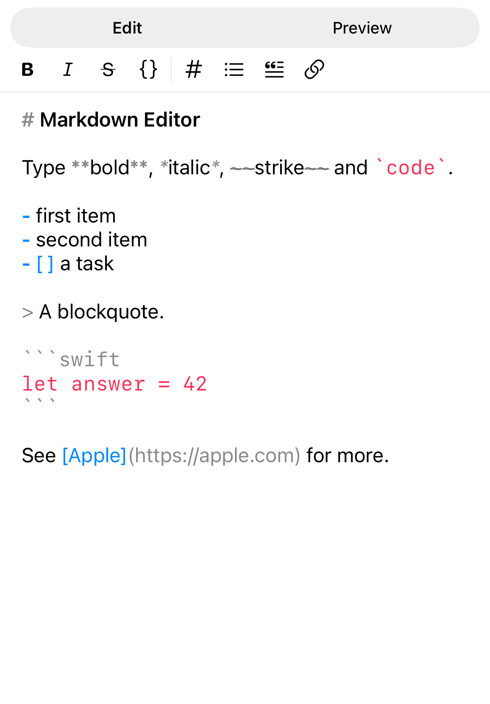
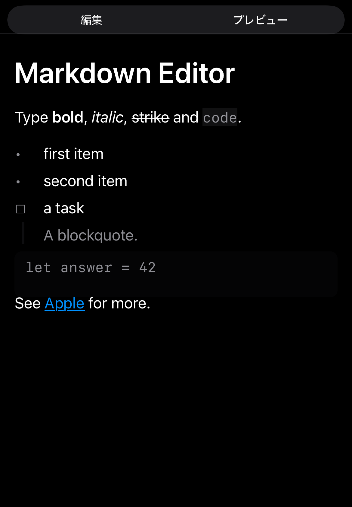

# SwiftMarkdownView

English | [日本語](./README.ja.md)

**Markdown live editing that works on both iOS and macOS** — plus the renderer it is built on.

`MarkdownEditor` is a SwiftUI editor with live syntax highlighting, a customizable formatting
toolbar, input rules, and a side-by-side preview on macOS. `MarkdownView` renders a whole document
into a single TextKit 2 text view, so selection runs across blocks and Copy yields readable text.


| Editing (light) | Rendered preview (dark) |
|---|---|
|  |  |

## Features

- **An editor on both platforms.** One `MarkdownEditor` for iOS and macOS. The macOS side is a
  full `NSTextView` implementation, not a compatibility shim
- **Selection that crosses blocks.** The document renders into a single text view, so dragging
  from a heading through a code block into a table copies as readable text
- **Live preview while typing.** Inline markers hide and render in place, Notion style, while the
  caret's own line keeps its markers so you can still edit them. The plain Markdown string stays
  the single source of truth
- **Customizable editing.** Build the toolbar from an item array, inject a controller to drive the
  editor from your own UI, add your own input rules
- **Rich elements.** Tables, task lists, images, Mermaid diagrams, LaTeX math, and 24 kinds of
  aside callout
- **No design-system lock-in.** Colors, metrics, and type sizes are plain protocols you implement.
  The defaults are system semantic colors and follow light and dark automatically
- **Opt-in extras.** Syntax highlighting for 50+ languages and LaTeX typesetting each arrive as a
  separate product, so the core carries neither dependency

## Usage

Render Markdown:

```swift
import SwiftUI
import SwiftMarkdownView

struct ArticleView: View {
    var body: some View {
        ScrollView {
            MarkdownView("""
            # Hello, Markdown!

            This is a **bold** and *italic* text.

            - [x] Task completed
            - [ ] Task pending
            """)
            .padding()
        }
    }
}
```

Edit Markdown. The editor binds to a plain `String` — there is no intermediate document model to
convert to and from:

```swift
import SwiftUI
import SwiftMarkdownEditor

struct NoteEditor: View {
    @State private var text = "# Draft\n\nStart writing."

    var body: some View {
        MarkdownEditor(text: $text)
    }
}
```

## Documentation

[API reference and guides](https://no-problem-dev.github.io/swift-markdown-view/documentation/swiftmarkdownview/) —
supported elements, theming, syntax highlighting, asides, Mermaid diagrams, and the editor guide.

Two runnable sample apps live in [`Examples/`](./Examples): `MarkdownPlayground` (editor, element
catalog, and a cross-block selection showcase) and `ZennArticleSwiftUI` (a real long-form article).

## Installation

Add the package to your `Package.swift`:

```swift
dependencies: [
    .package(url: "https://github.com/no-problem-dev/swift-markdown-view.git", from: "6.0.0")
]
```

Then add the products you need:

```swift
.target(
    name: "YourTarget",
    dependencies: [
        .product(name: "SwiftMarkdownView", package: "swift-markdown-view"),
        .product(name: "SwiftMarkdownEditor", package: "swift-markdown-view")
    ]
)
```

`SwiftMarkdownViewHighlightJS` (syntax highlighting), `SwiftMarkdownViewLaTeX` (math typesetting),
and the two `…DesignSystem` bridges are separate products you add only if you need them.

## License

MIT — see [LICENSE](LICENSE).
