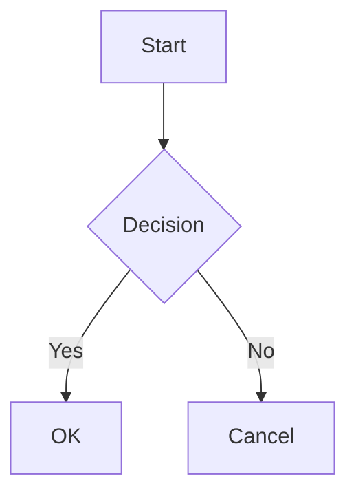

# SwiftMarkdownView

English | [日本語](README.md)

A SwiftUI-native Markdown rendering library. Integrates with DesignSystem for beautiful Markdown display.


## Features

- **SwiftUI Native**: High-performance rendering using `AttributedString` and `Text` concatenation
- **DesignSystem Integration**: Seamless integration with ColorPalette, Typography, and Spacing
- **Optional Syntax Highlighting**: 50+ languages via separate HighlightJS module
- **Rich Element Support**: Tables, task lists, images, Mermaid diagrams, and more
- **Customizable**: Style configuration through environment values

## Quick Start

```swift
import SwiftUI
import SwiftMarkdownView

struct ContentView: View {
    var body: some View {
        MarkdownView("""
        # Hello, Markdown!

        This is a **bold** and *italic* text.

        ```swift
        let greeting = "Hello, World!"
        print(greeting)
        ```

        - [x] Task completed
        - [ ] Task pending
        """)
    }
}
```

## Installation

### Swift Package Manager

Add to your `Package.swift`:

```swift
dependencies: [
    .package(url: "https://github.com/no-problem-dev/swift-markdown-view.git", from: "1.0.0")
]
```

Add to your target:

```swift
.target(
    name: "YourTarget",
    dependencies: [
        .product(name: "SwiftMarkdownView", package: "swift-markdown-view"),
        // For syntax highlighting (optional)
        .product(name: "SwiftMarkdownViewHighlightJS", package: "swift-markdown-view")
    ]
)
```

## Supported Elements

### Block Elements

| Element | Markdown | Notes |
|---------|----------|-------|
| Headings | `# H1` ~ `###### H6` | Typography integration |
| Paragraphs | text | |
| Code Blocks | ` ```swift ``` ` | Optional highlighting |
| Asides | `> Note: text` | 24 kinds + custom |
| Mermaid | ` ```mermaid ``` ` | iOS 26+ recommended |
| Unordered Lists | `- item` | Nested supported |
| Ordered Lists | `1. item` | Nested supported |
| Task Lists | `- [x] done` | |
| Tables | `\| col \|` | Alignment supported |
| Thematic Breaks | `---` | |

### Inline Elements

| Element | Markdown |
|---------|----------|
| Emphasis (italic) | `*text*` |
| Strong (bold) | `**text**` |
| Inline Code | `` `code` `` |
| Links | `[text](url)` |
| Images | `` |
| Strikethrough | `~~text~~` |

## Syntax Highlighting

### Default Behavior

By default, `PlainTextHighlighter` is used and code blocks are displayed without highlighting.

### HighlightJS Highlighting

To enable syntax highlighting with 50+ languages, use the optional module:

```swift
import SwiftMarkdownView
import SwiftMarkdownViewHighlightJS

// Recommended: Adaptive highlighting (auto light/dark mode)
MarkdownView(source)
    .adaptiveSyntaxHighlighting()

// With specific theme
MarkdownView(source)
    .adaptiveSyntaxHighlighting(theme: .github)

// Manual configuration
MarkdownView(source)
    .syntaxHighlighter(
        HighlightJSSyntaxHighlighter(theme: .atomOne, colorMode: .dark)
    )
```

**Available Themes**: `.a11y` (accessibility recommended), `.xcode`, `.github`, `.atomOne`, `.solarized`, `.tokyoNight`

### Custom Highlighter

Implement your own highlighting logic:

```swift
struct MyHighlighter: SyntaxHighlighter {
    func highlight(_ code: String, language: String?) async throws -> AttributedString {
        var result = AttributedString(code)
        // Custom implementation
        return result
    }
}

MarkdownView(source)
    .syntaxHighlighter(MyHighlighter())
```

## Asides (Callouts)

Blockquotes are interpreted as callouts such as Note, Warning, and Tip.

```swift
MarkdownView("""
> Note: This is supplementary information.

> Warning: This requires attention.

> Tip: Here's a helpful tip.
""")
```

**Supported Kinds**: `Note`, `Tip`, `Important`, `Warning`, `Experiment`, `Attention`, `Bug`, `ToDo`, `SeeAlso`, `Throws`, and 24 more + custom

### Custom Aside Style

```swift
struct MyAsideStyle: AsideStyle {
    func icon(for kind: AsideKind) -> String {
        switch kind {
        case .warning: return "flame.fill"
        default: return DefaultAsideStyle().icon(for: kind)
        }
    }

    func accentColor(for kind: AsideKind, colorPalette: any ColorPalette) -> Color {
        switch kind {
        case .tip: return .mint
        default: return DefaultAsideStyle().accentColor(for: kind, colorPalette: colorPalette)
        }
    }

    func backgroundColor(for kind: AsideKind, colorPalette: any ColorPalette) -> Color {
        accentColor(for: kind, colorPalette: colorPalette).opacity(0.15)
    }

    func titleColor(for kind: AsideKind, colorPalette: any ColorPalette) -> Color {
        accentColor(for: kind, colorPalette: colorPalette)
    }
}

MarkdownView(source)
    .asideStyle(MyAsideStyle())
```

## Mermaid Diagrams

Code blocks with `mermaid` language are rendered as diagrams.

```swift
MarkdownView("""

""")
```

**Supported Diagrams**: flowchart, sequence, class, state, gantt, journey, timeline, mindmap

**Requirements**:
- iOS 26+, macOS 26+: Native WebKit rendering
- Earlier versions: Fallback display (shown as code block)

## DesignSystem Theme

```swift
MarkdownView("# Themed Markdown")
    .environment(\.colorPalette, .dark)
    .environment(\.typographyScale, .large)
```

## Dependencies

| Package | Purpose | Required |
|---------|---------|----------|
| [swift-markdown](https://github.com/swiftlang/swift-markdown) | Markdown parsing | Yes |
| [swift-design-system](https://github.com/no-problem-dev/swift-design-system) | Design tokens | Yes |
| [HighlightSwift](https://github.com/nicklockwood/HighlightSwift) | Syntax highlighting | Optional |

## Documentation

Detailed API documentation is available on [GitHub Pages](https://no-problem-dev.github.io/swift-markdown-view/documentation/swiftmarkdownview/).

## License

MIT License - See [LICENSE](LICENSE) for details.
