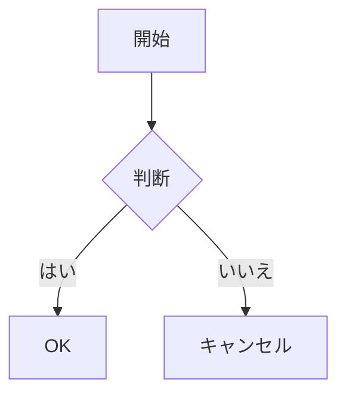
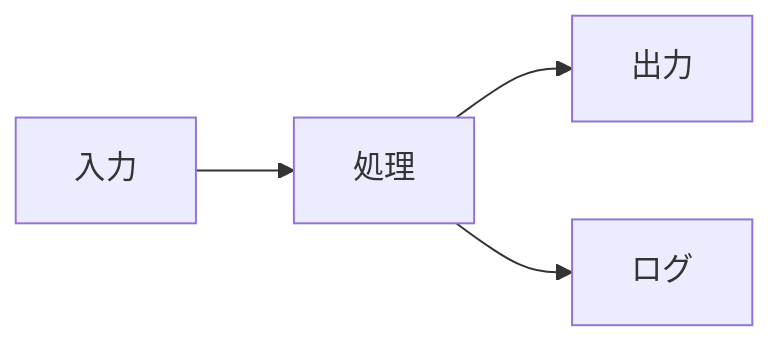
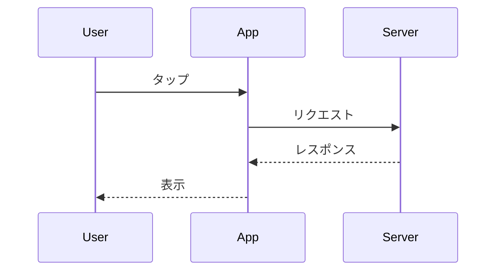
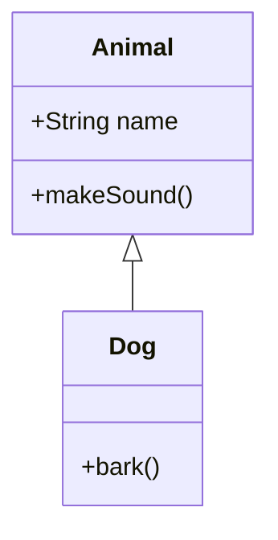
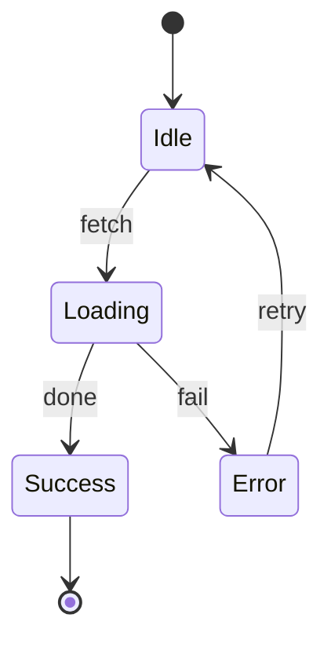

# Mermaidダイアグラム

Markdownコードブロック内でMermaidダイアグラムを表示する方法を学びます。

## Overview

SwiftMarkdownViewはMermaidダイアグラムをサポートしています。
コードブロックの言語に`mermaid`を指定すると、コードがダイアグラムとしてレンダリングされます。

## 基本的な使い方

```swift
MarkdownView("""

""")
```

## 対応ダイアグラム

以下のMermaidダイアグラムタイプがサポートされています：

| タイプ | 説明 | 例 |
|--------|------|-----|
| flowchart | フローチャート | `graph TD` |
| sequence | シーケンス図 | `sequenceDiagram` |
| class | クラス図 | `classDiagram` |
| state | 状態遷移図 | `stateDiagram-v2` |
| gantt | ガントチャート | `gantt` |
| journey | ユーザージャーニー | `journey` |
| timeline | タイムライン | `timeline` |
| mindmap | マインドマップ | `mindmap` |

## 動作環境

Mermaidダイアグラムのレンダリングはプラットフォームのバージョンによって異なります：

### iOS 26+、macOS 26+、tvOS 26+、watchOS 26+

WebKitを使用したネイティブレンダリングが行われます。
ダイアグラムは完全にインタラクティブに表示され、ライト/ダークモードに自動対応します。

### それ以前のバージョン

フォールバック表示が使用されます。
ダイアグラムはコードブロックとして表示され、Mermaidコードがそのまま見える状態になります。

## ダイアグラムの例

### フローチャート

```swift
MarkdownView("""

""")
```

### シーケンス図

```swift
MarkdownView("""

""")
```

### クラス図

```swift
MarkdownView("""

""")
```

### 状態遷移図

```swift
MarkdownView("""

""")
```

## テーマ

Mermaidダイアグラムはシステムのカラースキームに自動対応します：

- **ライトモード**: デフォルトのMermaidテーマ
- **ダークモード**: ダークテーマが自動適用

## パフォーマンス

Mermaidダイアグラムは内部でWebKitのWebViewを使用してレンダリングされます。
複雑なダイアグラムや多数のダイアグラムを含むドキュメントでは、
パフォーマンスに影響が出る場合があります。

## 制限事項

- iOS 26未満ではダイアグラムとしてレンダリングされません
- 非常に大きなダイアグラムはスクロールが必要になる場合があります
- インタラクティブな機能（クリックイベントなど）はサポートされていません
