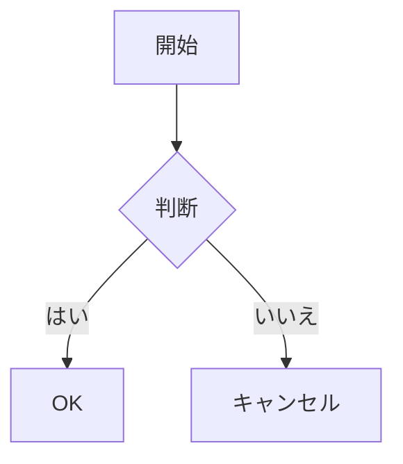
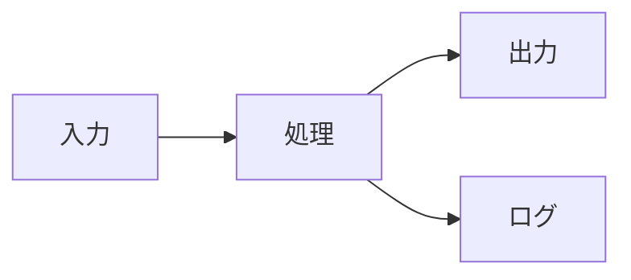
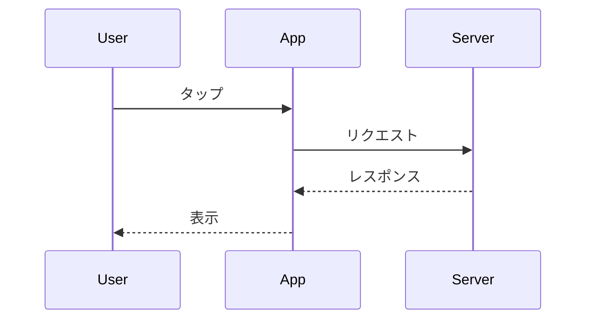
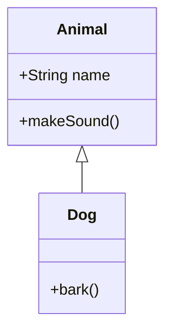
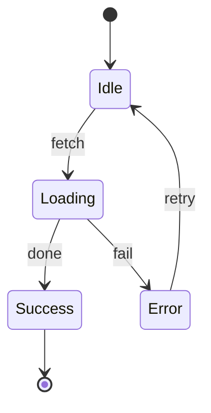

# Mermaidダイアグラム

Markdownコードブロック内でMermaidダイアグラムを表示する方法を学ぶ。

## Overview

SwiftMarkdownViewはMermaidダイアグラムをサポートしている。
コードブロックの言語に`mermaid`を指定すると、コードがダイアグラムとしてレンダリングされる。

## 基本的な使い方

```swift
MarkdownView("""

```mermaid
graph TD
    A[開始] --> B{判断}
    B -->|はい| C[OK]
    B -->|いいえ| D[キャンセル]
```
""")
```

## 対応ダイアグラム

以下のMermaidダイアグラムタイプがサポートされている：

| タイプ | 説明 | 例 |
|--------|------|-----|
| flowchart | フローチャート | `graph TD` |
| sequence | シーケンス図 | `sequenceDiagram` |
| class | クラス図 | `classDiagram` |
| state | 状態遷移図 | `stateDiagram-v2` |
| gantt | ガントチャート | `gantt` |
| journey | ユーザージャーニー | `journey` |
| timeline | タイムライン | `timeline` |
| mindmap | マインドマップ | `mindmap` |

## 動作環境

Mermaidダイアグラムのレンダリングはプラットフォームのバージョンによって異なる：

### iOS 26+、macOS 26+、tvOS 26+、watchOS 26+

WebKitを使用したネイティブレンダリングが行われる。
ダイアグラムは完全にインタラクティブに表示され、ライト/ダークモードに自動対応する。

### それ以前のバージョン

フォールバック表示が使用される。
ダイアグラムはコードブロックとして表示され、Mermaidコードがそのまま見える状態になる。

## ダイアグラムの例

### フローチャート

```swift
MarkdownView("""

```mermaid
graph LR
    A[入力] --> B[処理]
    B --> C[出力]
    B --> D[ログ]
```
""")
```

### シーケンス図

```swift
MarkdownView("""

```mermaid
sequenceDiagram
    participant User
    participant App
    participant Server
    User->>App: タップ
    App->>Server: リクエスト
    Server-->>App: レスポンス
    App-->>User: 表示
```
""")
```

### クラス図

```swift
MarkdownView("""

```mermaid
classDiagram
    class Animal {
        +String name
        +makeSound()
    }
    class Dog {
        +bark()
    }
    Animal <|-- Dog
```
""")
```

### 状態遷移図

```swift
MarkdownView("""

```mermaid
stateDiagram-v2
    [*] --> Idle
    Idle --> Loading: fetch
    Loading --> Success: done
    Loading --> Error: fail
    Success --> [*]
    Error --> Idle: retry
```
""")
```

## テーマ

Mermaidダイアグラムはシステムのカラースキームに自動対応する：

- **ライトモード**: デフォルトのMermaidテーマ
- **ダークモード**: ダークテーマが自動適用

## パフォーマンス

Mermaidダイアグラムは内部でWebKitのWebViewを使用してレンダリングされる。
複雑なダイアグラムや多数のダイアグラムを含むドキュメントでは、
パフォーマンスに影響が出る場合がある。

## 制限事項

- iOS 26未満ではダイアグラムとしてレンダリングされない
- 非常に大きなダイアグラムはスクロールが必要になる場合がある
- インタラクティブな機能（クリックイベントなど）はサポートされていない
