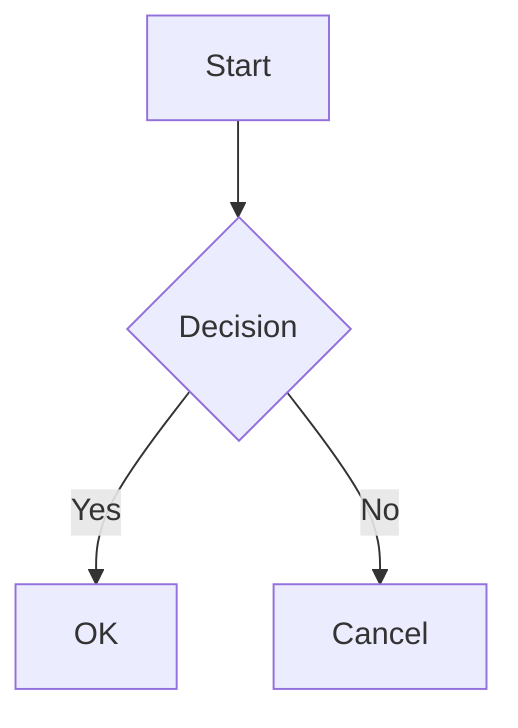

# Mermaid Diagrams

Draw flowcharts, sequence diagrams, and the rest from fenced `mermaid` code blocks.

## Overview

A code block tagged `mermaid` is drawn as a diagram rather than as source:

```swift
MarkdownView("""

```mermaid
graph TD
    A[Start] --> B{Decision}
    B -->|Yes| C[OK]
    B -->|No| D[Cancel]
```
""")
```

Rendering happens in a `WKWebView` attachment placed inline in the document, driven by the real
Mermaid.js library. Whatever Mermaid.js can draw, this can draw — flowcharts, sequence, class,
state, entity-relationship, Gantt, journey, timeline, and mindmap among them — because the diagram
grammar is Mermaid's, not this package's.

The web view follows the surrounding color scheme, so a diagram in a dark-mode document is drawn
with Mermaid's dark theme.

## Supplying the script

Mermaid.js itself is not bundled. A ``MermaidScriptProvider`` says where to get it, and the
default is ``CDNMermaidScriptProvider``, which fetches from jsDelivr.

That default needs a network connection. For an app that must draw diagrams offline, ship
`mermaid.min.js` in your bundle and use ``BundledMermaidScriptProvider``:

```swift
MarkdownView(source)
    .markdownMermaidScriptProvider(BundledMermaidScriptProvider() ?? .cdn)
```

`BundledMermaidScriptProvider` returns `nil` when the resource is missing rather than reaching for
the CDN behind your back, which is why the fallback above is written out in the open. Choosing to
fall back to the network is a decision worth seeing in the code, particularly in an app that
claims to work offline.

## When a diagram is not drawn

There is no OS-version gate — diagrams render on every platform version the package supports. What
can go wrong is the script.

If the script cannot be resolved — a bundled file that is missing or unreadable — **the diagram
area is empty**. It does not degrade into a visible code block. Copying still yields the original
fenced `mermaid` source, so the content is not lost from the text, but nothing is shown on screen.
Verify the bundled resource actually ships in your target if diagrams come up blank.

## Size and performance

Each diagram takes a fixed-height box the width of the container. A diagram larger than that box
scrolls inside it, so one oversized diagram cannot disturb the layout of the document around it.

Every diagram is a live web view. A document with many of them pays for many web views, so prefer
splitting a diagram-heavy document across screens rather than rendering all of it at once.

Interactive Mermaid features such as click bindings are not wired to anything.

## Topics

### Script providers

- ``MermaidScriptProvider``
- ``MermaidScriptSource``
- ``CDNMermaidScriptProvider``
- ``BundledMermaidScriptProvider``
